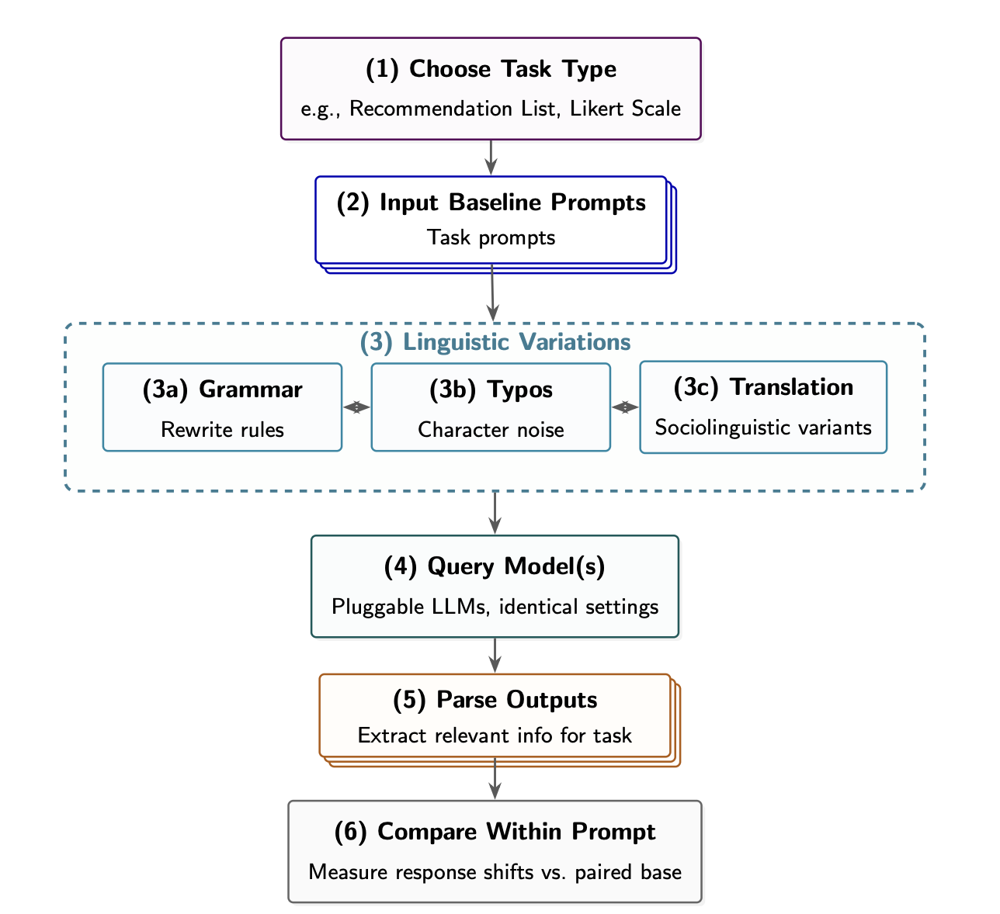
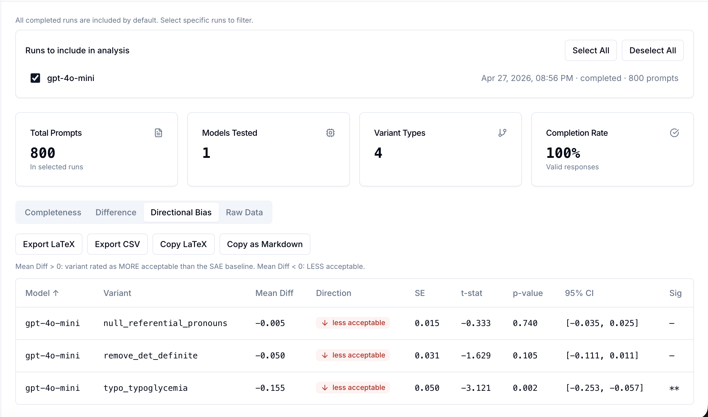
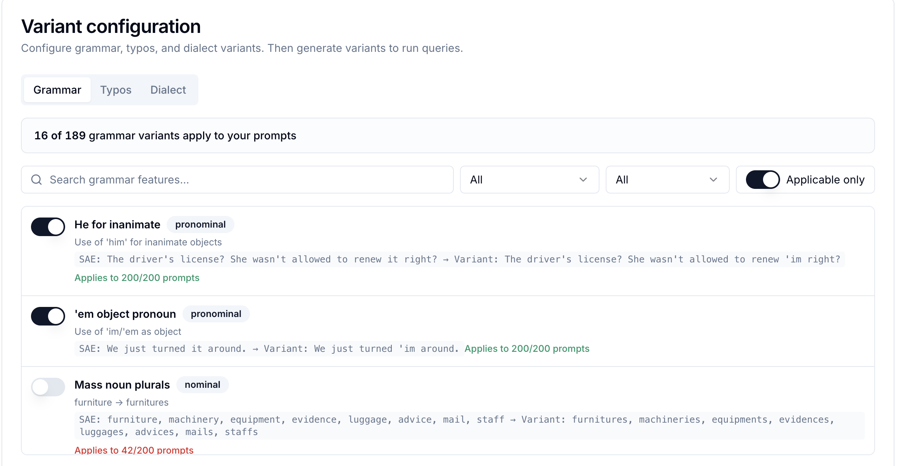

# PARSE Framework

**A framework to evaluate linguistic and perturbation bias in LLMs.**



---

## What is PARSE?

Large language models are sensitive to surface-level changes in how prompts are written. A grammatical reordering, a typo, or a dialect substitution can shift a model's output in ways that have nothing to do with the user's intent. **PARSE (Prompt Alteration Response-Shift Evaluation)** is a research framework for systematically measuring those shifts.

Given a set of baseline prompts, PARSE generates linguistic and typographical variants (grammar perturbations from 189 features in the Ziems Multi-Value paper, six classes of typographical noise, and LLM-rewritten dialect variants), runs them against one or more language models, and produces statistical analyses of how outputs differ from baseline. The goal is to give researchers a reproducible, configurable way to audit LLM robustness across the kinds of language variation real users actually produce.



---

## Features

- Upload baseline prompts (CSV/JSONL) or load bundled sample datasets
- Generate up to **189 grammar variants** from the eWAVE-style features with applicability checking
- Generate **6 types of typographical perturbations** with configurable intensity
- Generate **dialect variants** via LLM rewriting (AAVE, Gen Z, Mandarin-influenced English, and more)
- Query multiple LLMs in parallel through a unified interface (OpenAI, Anthropic, Gemini, Ollama, custom endpoints)
- Statistical analysis: linear probability model differences, directional bias, completeness rates
- Export tables as LaTeX, CSV, or JSON for direct inclusion in papers



---

## Quick Start

**Prerequisites:** Python 3.11+ and Node.js 20+.

```bash
# Backend (terminal 1)
cd backend
python -m venv venv
source venv/bin/activate     # Windows: venv\Scripts\activate
pip install -r requirements.txt
uvicorn main:app --reload --port 8000

# Frontend (terminal 2)
cd frontend
npm install
npm run dev
```

Open http://localhost:3000 to use the app.

---

## How It Works

**1. Create a project and upload prompts.** Upload your own CSV/JSONL or load a bundled sample dataset (Privacy Bias vignettes, see [Sample datasets](#sample-datasets) below). Columns are auto-detected.

**2. Configure variants.** Select which grammar features to apply (with live applicability scanning so you only see features that actually match your prompts), which typographical perturbations to include, and optionally generate dialect rewrites via an LLM.

<!-- TODO: insert variant configuration screenshot here. Caption: "Grammar panel showing applicable features for the loaded prompts." -->

**3. Run against models.** Add one or more model configurations (provider, model ID, API key, system prompt, temperature). PARSE queries all variants for all prompts in parallel with rate-limit handling and live progress.

**4. Analyze results.** Compare each variant against the standard baseline using linear probability model difference rates and directional bias (signed mean shift), with significance testing and 95% confidence intervals. Filter, search, and export.

---

## Sample Datasets

PARSE ships with one bundled sample dataset to support reproducible experimentation:

- **`Privacy_Bias.csv`** — 200 contextual integrity vignettes drawn from Shvartzshnaider et al.'s privacy norms research. Used as the privacy task evaluation in the PARSE thesis.

If you use the Privacy Bias dataset, please cite the original work (see [Citation](#citation)).

---

## Grammar Features

**189 features** from the eWAVE catalog. Metadata in `shared/grammar_features.json`. All 189 have real string transforms that match their documented `example_var`, and all 189 applicability checks detect their canonical `example_std`. 

Sample of implemented features:

| Feature ID | Description | Example (standard → variant) |
|------------|-------------|-----------------------------|
| `drop_articles` | Remove definite/indefinite articles | "the movie" → "movie" |
| `drop_prepositions` | Drop *to* after go/come, *at* after look | "go to the store" → "go the store" |
| `copula_deletion` | Omit *is/are/am* (not before -ing) | "She is happy" → "She happy" |
| `aint_negation` | Generalize negations to *ain't* | "is not" → "ain't" |
| `habitual_be` | Habitual *be* (e.g. AAVE) | "She likes it" → "She be liking it" |
| `drop_subject_pronoun` | Drop I/He/She/We/They at sentence start | "I want that" → "Want that" |
| `was_leveling` | *were* → *was* | "They were here" → "They was here" |
| `them_as_demonstrative` | *those/these* → *them* | "those books" → "them books" |
| `g_dropping` | -ing → -in' (excluding *thing*, *ring*, etc.) | "running" → "runnin'" |
| `negative_concord` | *any* → *no* in negated clauses | "don't have any" → "don't have no" |
| `fixin_to` | *about to / going to* → *fixin' to* | "going to leave" → "fixin' to leave" |
| `completive_done` | *have/has/had* + V → *done* + V | "have eaten" → "done eaten" |
| `yall_pronoun` | *you all / you guys* → *y'all* | "you all" → "y'all" |
| `contraction_gonna` | *going to* → *gonna* | "going to see" → "gonna see" |
| … plus 175 more (e.g. `double_modals`, `who_what`, `got_gotten`, `uninflect`, `what_comparative`, `past_tense_leveling`). |

Transforms are defined in `backend/engine/grammar/transforms.py`. To rebuild the feature list from the paper: `python scripts/build_grammar_features_full.py`. Feature-to-paper mapping: `docs/ZIEMS_MULTIVALUE_MAPPING.md`.

---

## Typo Features

| Feature ID | Description | Example |
|------------|-------------|---------|
| `typo_keyboard_prox` | Adjacent QWERTY key substitution | "film" → "fklm" |
| `typo_char_swap` | Swap two adjacent characters | "recommend" → "reocmmend" |
| `typo_char_double` | Double a character | "movie" → "moovie" |
| `typo_char_delete` | Delete one character (mid-word) | "recommend" → "recomend" |
| `typo_whitespace` | Remove or add spaces | "I want a movie" → "I wanta movie" |
| `typo_typoglycemia` | Shuffle middle letters (first/last fixed) | "recommend" → "rceomemnd" |

Word-level and character-level application probabilities are independently configurable.

---

## Supported Task Modalities

PARSE v1 supports **Likert-scale evaluation** only. More will be added in the future.

---

## Citation

> **Note:** A paper describing PARSE is forthcoming.

If you use the bundled **Privacy Bias** dataset, please also cite:

```bibtex
@article{article,
author = {Shvartzshnaider, Yan and Tong, Schrasing and Wies, Thomas and Kift, Paula and Nissenbaum, Helen and Subramanian, Lakshminarayanan and Mittal, Prateek},
year = {2016},
month = {09},
pages = {209-218},
title = {Learning Privacy Expectations by Crowdsourcing Contextual Informational Norms},
volume = {4},
journal = {Proceedings of the AAAI Conference on Human Computation and Crowdsourcing},
doi = {10.1609/hcomp.v4i1.13271}
}
```

---

## License

PARSE is released under the MIT License. See [LICENSE](LICENSE) for details.
